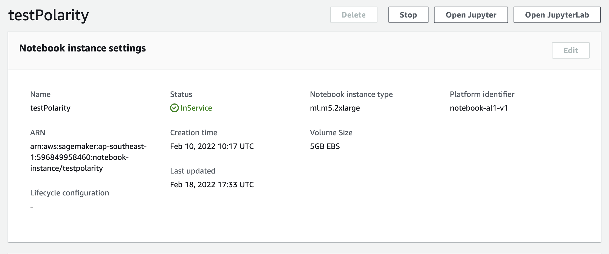
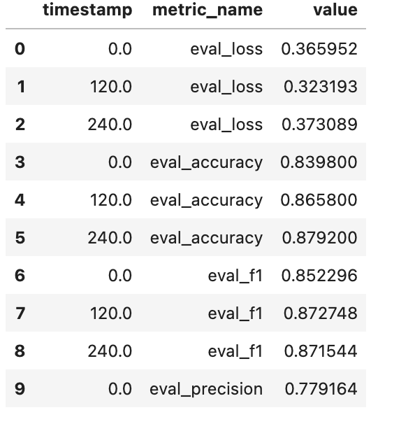
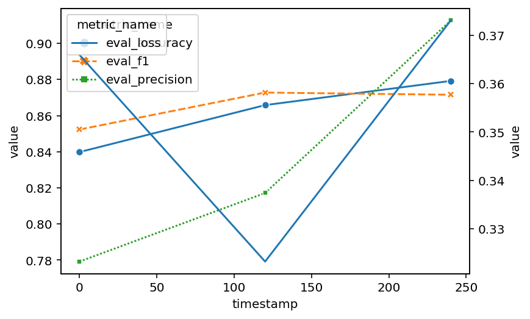

## Assignment using Sagemaker
In this assignment we are supposed to take a classification problem and train using  sagemaker platform

One of the salient part of this assignment is to create a Youtube video describing the code. Below is the link to the youtube video

https://www.youtube.com/watch?v=Q9h1FuktujA


### Dataset Used
IMDB. This is the movie review dataset with positive and negative classification of the reviews. The data has been taken from https://huggingface.co/datasets/imdb

The data containes 25K training sample and 25K testing samples

The training set is balanced with equal number of negative and positive reviews

To keep the training cost low we have randomly taken 5000 samples of training and testing. 

```
train_dataset = train_dataset.shuffle().select(range(5000)) 
test_dataset = test_dataset.shuffle().select(range(5000))

```

## Model Used

 DistilBERT base  model (cased)


Model Link: https://huggingface.co/distilbert-base-cased

We will perform the fine tuning of the distilbert-base

## Code file 
The code file is at 
https://github.com/TSAI-END3-Group/Session13_Sagemaker/blob/master/notebook/imdb.ipynb


This file is a direct dump of the code written on the Sagemaker notebook



## Trainign Logs

Following is the training log dump

```
2022-02-18 18:50:05 Starting - Starting the training job......
2022-02-18 18:50:40 Starting - Preparing the instances for training...........
2022-02-18 18:51:41 Downloading - Downloading input data...
2022-02-18 18:52:02 Training - Downloading the training image.........................................
2022-02-18 18:55:30 Training - Training image download completed. Training in progress..............................................................................
2022-02-18 19:02:07 Uploading - Uploading generated training model........
2022-02-18 19:02:53 Completed - Training job completed
{'TrainingJobName': 'finetune-distilbert-base-cased-2022-02-18-18-49-27',
 'TrainingJobArn': 'arn:aws:sagemaker:ap-southeast-1:596849958460:training-job/finetune-distilbert-base-cased-2022-02-18-18-49-27',
 'ModelArtifacts': {'S3ModelArtifacts': 's3://sagemaker-ap-southeast-1-596849958460/finetune-distilbert-base-cased-2022-02-18-18-49-27/output/model.tar.gz'},
 'TrainingJobStatus': 'Completed',
 'SecondaryStatus': 'Completed',
 'HyperParameters': {'epochs': '3',
  'model_name': '"distilbert-base-cased"',
  'output_dir': '"/opt/ml/checkpoints"',
  'sagemaker_container_log_level': '20',
  'sagemaker_job_name': '"finetune-distilbert-base-cased-2022-02-18-18-49-27"',
  'sagemaker_program': '"train.py"',
  'sagemaker_region': '"ap-southeast-1"',
  'sagemaker_submit_directory': '"s3://sagemaker-ap-southeast-1-596849958460/finetune-distilbert-base-cased-2022-02-18-18-49-27/source/sourcedir.tar.gz"',
  'tokenizer_name': '"distilbert-base-cased"',
  'train_batch_size': '32'},
 'AlgorithmSpecification': {'TrainingImage': '763104351884.dkr.ecr.ap-southeast-1.amazonaws.com/huggingface-pytorch-training:1.7-transformers4.6-gpu-py36-cu110-ubuntu18.04',
  'TrainingInputMode': 'File',
  'MetricDefinitions': [{'Name': 'loss',
    'Regex': "'loss': ([0-9]+(.|e\\-)[0-9]+),?"},
   {'Name': 'learning_rate',
    'Regex': "'learning_rate': ([0-9]+(.|e\\-)[0-9]+),?"},
   {'Name': 'eval_loss', 'Regex': "'eval_loss': ([0-9]+(.|e\\-)[0-9]+),?"},
   {'Name': 'eval_accuracy',
    'Regex': "'eval_accuracy': ([0-9]+(.|e\\-)[0-9]+),?"},
   {'Name': 'eval_f1', 'Regex': "'eval_f1': ([0-9]+(.|e\\-)[0-9]+),?"},
   {'Name': 'eval_precision',
    'Regex': "'eval_precision': ([0-9]+(.|e\\-)[0-9]+),?"},
   {'Name': 'eval_recall', 'Regex': "'eval_recall': ([0-9]+(.|e\\-)[0-9]+),?"},
   {'Name': 'eval_runtime',
    'Regex': "'eval_runtime': ([0-9]+(.|e\\-)[0-9]+),?"},
   {'Name': 'eval_samples_per_second',
    'Regex': "'eval_samples_per_second': ([0-9]+(.|e\\-)[0-9]+),?"},
   {'Name': 'epoch', 'Regex': "'epoch': ([0-9]+(.|e\\-)[0-9]+),?"}],
  'EnableSageMakerMetricsTimeSeries': True},
 'RoleArn': 'arn:aws:iam::596849958460:role/service-role/AmazonSageMaker-ExecutionRole-20220209T230020',
 'InputDataConfig': [{'ChannelName': 'train',
   'DataSource': {'S3DataSource': {'S3DataType': 'S3Prefix',
     'S3Uri': 's3://sagemaker-ap-southeast-1-596849958460/samples/datasets/imdb/train',
     'S3DataDistributionType': 'FullyReplicated'}},
   'CompressionType': 'None',
   'RecordWrapperType': 'None'},
  {'ChannelName': 'test',
   'DataSource': {'S3DataSource': {'S3DataType': 'S3Prefix',
     'S3Uri': 's3://sagemaker-ap-southeast-1-596849958460/samples/datasets/imdb/test',
     'S3DataDistributionType': 'FullyReplicated'}},
   'CompressionType': 'None',
   'RecordWrapperType': 'None'}],
 'OutputDataConfig': {'KmsKeyId': '',
  'S3OutputPath': 's3://sagemaker-ap-southeast-1-596849958460/'},
 'ResourceConfig': {'InstanceType': 'ml.p3.2xlarge',
  'InstanceCount': 1,
  'VolumeSizeInGB': 30},
 'StoppingCondition': {'MaxRuntimeInSeconds': 36000},
 'CreationTime': datetime.datetime(2022, 2, 18, 18, 50, 4, 944000, tzinfo=tzlocal()),
 'TrainingStartTime': datetime.datetime(2022, 2, 18, 18, 51, 41, 811000, tzinfo=tzlocal()),
 'TrainingEndTime': datetime.datetime(2022, 2, 18, 19, 2, 53, 172000, tzinfo=tzlocal()),
 'LastModifiedTime': datetime.datetime(2022, 2, 18, 19, 2, 53, 172000, tzinfo=tzlocal()),
 'SecondaryStatusTransitions': [{'Status': 'Starting',
   'StartTime': datetime.datetime(2022, 2, 18, 18, 50, 4, 944000, tzinfo=tzlocal()),
   'EndTime': datetime.datetime(2022, 2, 18, 18, 51, 41, 811000, tzinfo=tzlocal()),
   'StatusMessage': 'Preparing the instances for training'},
  {'Status': 'Downloading',
   'StartTime': datetime.datetime(2022, 2, 18, 18, 51, 41, 811000, tzinfo=tzlocal()),
   'EndTime': datetime.datetime(2022, 2, 18, 18, 52, 2, 174000, tzinfo=tzlocal()),
   'StatusMessage': 'Downloading input data'},
  {'Status': 'Training',
   'StartTime': datetime.datetime(2022, 2, 18, 18, 52, 2, 174000, tzinfo=tzlocal()),
   'EndTime': datetime.datetime(2022, 2, 18, 19, 2, 7, 536000, tzinfo=tzlocal()),
   'StatusMessage': 'Training image download completed. Training in progress.'},
  {'Status': 'Uploading',
   'StartTime': datetime.datetime(2022, 2, 18, 19, 2, 7, 536000, tzinfo=tzlocal()),
   'EndTime': datetime.datetime(2022, 2, 18, 19, 2, 53, 172000, tzinfo=tzlocal()),
   'StatusMessage': 'Uploading generated training model'},
  {'Status': 'Completed',
   'StartTime': datetime.datetime(2022, 2, 18, 19, 2, 53, 172000, tzinfo=tzlocal()),
   'EndTime': datetime.datetime(2022, 2, 18, 19, 2, 53, 172000, tzinfo=tzlocal()),
   'StatusMessage': 'Training job completed'}],
 'FinalMetricDataList': [{'MetricName': 'eval_loss',
   'Value': 0.3730885982513428,
   'Timestamp': datetime.datetime(2022, 2, 18, 19, 1, 39, tzinfo=tzlocal())},
  {'MetricName': 'eval_accuracy',
   'Value': 0.8791999816894531,
   'Timestamp': datetime.datetime(2022, 2, 18, 19, 1, 39, tzinfo=tzlocal())},
  {'MetricName': 'eval_f1',
   'Value': 0.8715440034866333,
   'Timestamp': datetime.datetime(2022, 2, 18, 19, 1, 39, tzinfo=tzlocal())},
  {'MetricName': 'eval_precision',
   'Value': 0.9126948714256287,
   'Timestamp': datetime.datetime(2022, 2, 18, 19, 1, 39, tzinfo=tzlocal())},
  {'MetricName': 'eval_recall',
   'Value': 0.8339438438415527,
   'Timestamp': datetime.datetime(2022, 2, 18, 19, 1, 39, tzinfo=tzlocal())},
  {'MetricName': 'eval_runtime',
   'Value': 24.708999633789062,
   'Timestamp': datetime.datetime(2022, 2, 18, 19, 1, 39, tzinfo=tzlocal())},
  {'MetricName': 'eval_samples_per_second',
   'Value': 202.35499572753906,
   'Timestamp': datetime.datetime(2022, 2, 18, 19, 1, 39, tzinfo=tzlocal())},
  {'MetricName': 'epoch',
   'Value': 3.0,
   'Timestamp': datetime.datetime(2022, 2, 18, 19, 1, 39, tzinfo=tzlocal())}],
 'EnableNetworkIsolation': False,
 'EnableInterContainerTrafficEncryption': False,
 'EnableManagedSpotTraining': False,
 'TrainingTimeInSeconds': 672,
 'BillableTimeInSeconds': 672,
 'DebugHookConfig': {'S3OutputPath': 's3://sagemaker-ap-southeast-1-596849958460/',
  'CollectionConfigurations': []},
 'ProfilerConfig': {'S3OutputPath': 's3://sagemaker-ap-southeast-1-596849958460/',
  'ProfilingIntervalInMilliseconds': 500},
 'ProfilerRuleConfigurations': [{'RuleConfigurationName': 'ProfilerReport-1645210204',
   'RuleEvaluatorImage': '972752614525.dkr.ecr.ap-southeast-1.amazonaws.com/sagemaker-debugger-rules:latest',
   'VolumeSizeInGB': 0,
   'RuleParameters': {'rule_to_invoke': 'ProfilerReport'}}],
 'ProfilerRuleEvaluationStatuses': [{'RuleConfigurationName': 'ProfilerReport-1645210204',
   'RuleEvaluationJobArn': 'arn:aws:sagemaker:ap-southeast-1:596849958460:processing-job/finetune-distilbert-base-c-profilerreport-1645210204-dfdabd65',
   'RuleEvaluationStatus': 'InProgress',
   'LastModifiedTime': datetime.datetime(2022, 2, 18, 19, 2, 44, 579000, tzinfo=tzlocal())}],
 'ProfilingStatus': 'Enabled',
 'ResponseMetadata': {'RequestId': '29c8779d-820c-4298-8cba-7cd6d528942c',
  'HTTPStatusCode': 200,
  'HTTPHeaders': {'x-amzn-requestid': '29c8779d-820c-4298-8cba-7cd6d528942c',
   'content-type': 'application/x-amz-json-1.1',
   'content-length': '5551',
   'date': 'Fri, 18 Feb 2022 19:02:55 GMT'},
  'RetryAttempts': 0}}


```


## Evaluation Results

The accuracy on the test data is about 88%.. this will improve if we consider the full sample but to save the aws bill we used only 5000 samples




Here is the graph of various metrics that we considered




## Sample Inferences
Running on some of the data we got the following result
```
data = {
   "inputs": [
       "i liked the movie",
       "i liked the movie for the story , but the action was very bad"
   ]
}


{'label': 'LABEL_1', 'score': 0.9945787787437439},
 {'label': 'LABEL_0', 'score': 0.9906011819839478}]

 ```


 ## Contributors
* Rohit Agarwal
* Kushal Gandhi
* Vivek Kumar
